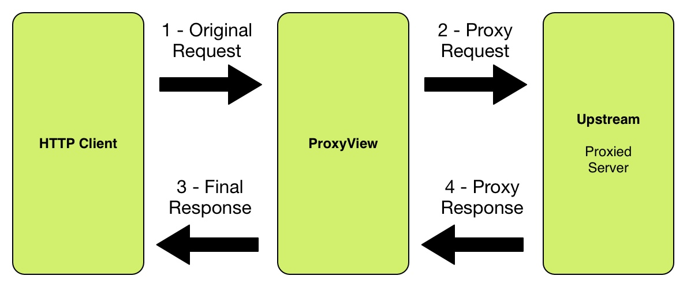

Introduction
==================

How does it work?
-----------------

At a high level, this is what happens when a user uses revproxy in his application

1. The application using revproxy receives a request from the client
2. Revproxy will create a new request using the body, cookies and headers from the original request. This new
   request will be made to the upstream address that must be set by the user.
3. After receiving the response from upstream address, revproxy will replace the upstream host from the response header location to the original
   request host
4. Once this is done, the response received by upstream server will parsed to a django.http.HttpResponse 
5. Finally, if the user has setted a set of diazo rules and a diazo template, revproxy will perform a xslt on the response content based on these parameters
6. The response will then be returned to the user

It also must be said that revproxy possess some extra features, such as:

* Adding a remote user to the response if the user want to be logged in django
* Revproxy handles all HTTP Method and can copy all headers from the request to the upstream server, except hop-by-hop headers

The github page can be found on:

https://github.com/TracyWebTech/django-revproxy

Visual diagram
---------------------------------------

